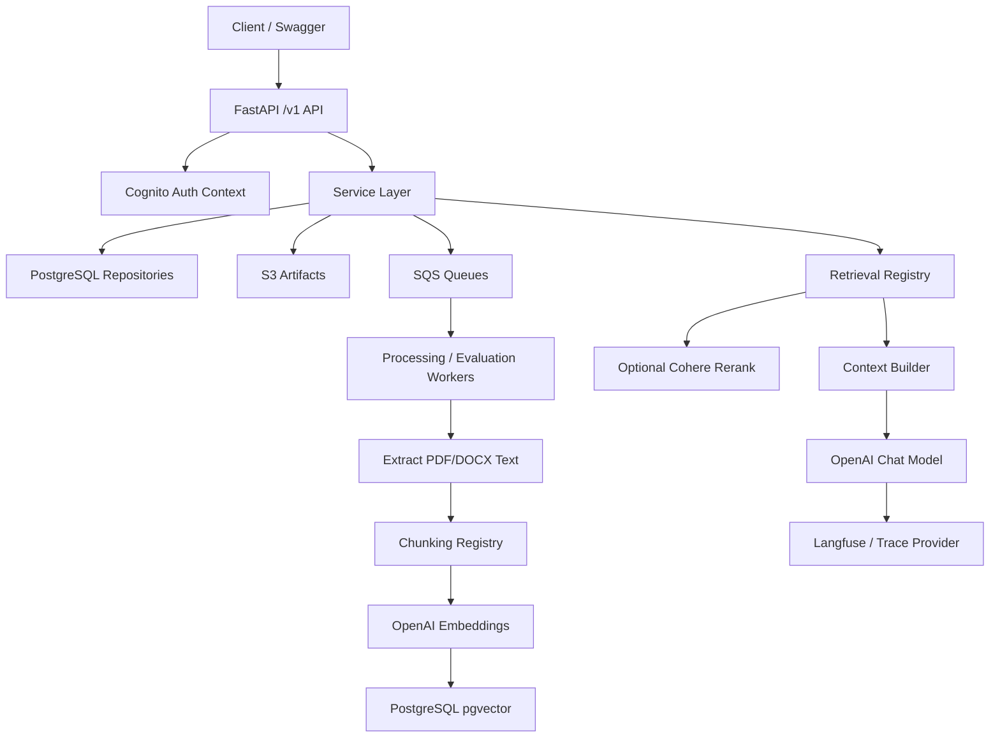

# GenAI Platform Backbone Architecture

This design is a reusable backend foundation for GenAI products. It is not a LangGraph implementation by itself. LangGraph workflows can be added later and should call this platform for ingestion, retrieval, evaluation, traces, and model access.

## Locked Decisions

- API framework: FastAPI
- Runtime: ECS/Fargate
- Auth: Amazon Cognito
- Metadata DB: PostgreSQL
- Vector DB: PostgreSQL with pgvector
- Object storage: S3
- Async jobs: SQS
- Embeddings: OpenAI `text-embedding-3-small`
- Generation: OpenAI `gpt-4.1-mini` by default
- Reranking: Bedrock Cohere rerank only
- Observability: Langfuse-compatible provider boundary

## Non-Goals For This Subproject

- No LangGraph workflow code yet.
- No UI.
- No custom agent builder.
- No no-code SaaS studio.
- No Bedrock LLM conversion.

## Main Runtime Flow



## Module Rules

Routers should stay thin. They parse schemas, get auth context, and call services.

Services own business behavior and orchestration between repositories and providers.

Repositories own database access.

Providers own external system access: S3, SQS, OpenAI, Bedrock, Cognito, Langfuse.

Registries own pluggable strategies like chunking and retrieval.

## Folder Responsibilities

```text
app/api/v1        HTTP routers
app/core          settings, logging, errors, auth dependency, response envelope
app/schemas       Pydantic API models
app/services      business logic
app/repositories  database access boundaries
app/providers     external integrations
app/registries    chunking and retrieval strategies
app/workers       async worker entrypoints
sql               PostgreSQL and pgvector migrations
infra             CloudFormation starter stack
langfuse          local Langfuse compose
tests             unit and smoke tests
```

